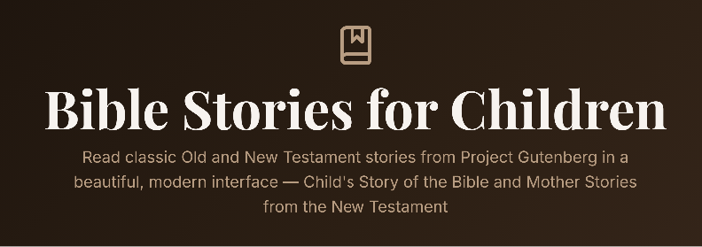

[](https://childrens-bible.vercel.app/)

# 📖 Bible Stories for Children

**A beautiful, modern reader for classic Old & New Testament stories — made for families, kids, and anyone who loves timeless scripture retold with care.**

🌐 **Live app:** [childrens-bible.vercel.app](https://childrens-bible.vercel.app/)

---

## ✨ Why you'll love it

Bring Project Gutenberg's beloved children's Bible collections into one calm, readable experience — no ads, no clutter, just stories.

| | |
|---|---|
| 📚 **127 stories** | Old & New Testament collections in one place |
| 🔍 **Smart search** | Find paragraphs fast, with highlights & scroll-to-match |
| 🎧 **Read aloud** | Listen to stories or selected text with built-in controls |
| 🌙 **Dark mode** | Easy on the eyes for bedtime reading |
| 📱 **Responsive** | Looks great on phone, tablet, and desktop |
| 🎨 **Thoughtful design** | Warm beige tones, elegant typography, smooth navigation |

---

## 📜 Story sources (public domain)

All texts are **public domain** in the United States, from [Project Gutenberg](https://www.gutenberg.org/):

| Book | Author | Stories |
|------|--------|---------|
| [Child's Story of the Bible](https://www.gutenberg.org/ebooks/25309) | Mary A. Lathbury | 34 OT + 48 NT |
| [Mother Stories from the New Testament](https://www.gutenberg.org/ebooks/17163) | Anonymous | 45 NT |

---

## 🚀 Quick start

```bash
git clone https://github.com/raimonvibe/childrens-bible.git
cd childrens-bible
npm install
npm run dev
```

Open [http://localhost:3000](http://localhost:3000) in your browser.

### 🏗️ Production build

```bash
npm run build
npm start
```

### 🔄 Regenerate story data

Raw Gutenberg texts live in `source/`; parsed JSON is written to `data/`:

```bash
npm run parse-gutenberg
```

---

## 🧭 How to use the app

1. **Browse** — Pick a collection (Old or New Testament)
2. **Read** — Open any story and use **Previous / Next** to keep going
3. **Search** — Tap **Search**, type a word or phrase, and jump straight to the match
4. **Listen** — Use the read-aloud panel to hear a story or a highlighted selection

---

## 🛠️ Tech stack

- **Framework:** [Next.js 16](https://nextjs.org/) (App Router)
- **Language:** TypeScript
- **Styling:** Tailwind CSS
- **Icons:** Lucide React
- **Fonts:** Playfair Display, Merriweather, Inter

---

## 📁 Project structure

```
├── app/              # Pages, layout, and /api/bible-data
├── components/       # BookSelector, BibleReader, AdvancedSearch, etc.
├── data/             # Parsed story JSON (OT + NT)
├── hooks/            # Read-aloud and viewport helpers
├── lib/              # Search, read-aloud utilities
├── public/           # Favicon, manifest, OG image
├── scripts/          # Gutenberg parser
└── source/           # Original .txt files from Project Gutenberg
```

---

## 🤝 Related

Styled with the same warm, readable feel as [bible-old-and-new-testament](https://github.com/raimonvibe/bible-old-and-new-testament).

---

## 📄 License

Story texts are **public domain** via Project Gutenberg.  
Application code is open source — see the repository for details.

Made with ❤️ for families and readers everywhere.
